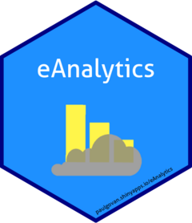

<!-- README.md is generated from README.Rmd. Please edit that file -->

```{r, include = FALSE}
knitr::opts_chunk$set(
  collapse = TRUE,
  comment = "#>",
  fig.path = "man/figures/README-",
  out.width = "100%"
)
```

# eAnalytics <a href="http://paulgovan.github.io/eAnalytics/"></a>

<!-- badges: start -->
[](https://www.repostatus.org/#active)
[](https://CRAN.R-project.org/package=eAnalytics)
[](https://github.com/paulgovan/eAnalytics/actions/workflows/R-CMD-check.yaml)
[](https://cran.r-project.org/package=eAnalytics)
[](https://cran.r-project.org/package=eAnalytics)
[](https://doi.org/10.5334/jors.144)
<!-- badges: end -->

## Features
* Profile: take an overview of the industry
* Performance: measure key performance indicators (KPIs)
* Trends: identify changes in the industry over time
* Explorer: discover new relationships in the data

## Overview
`eAnalytics` is a [shiny](https://shiny.posit.co/) web application built on top of [R](https://www.r-project.org) for energy analytics. To learn more about this project, check out this [article](https://doi.org/10.5334/jors.144).

## Getting Started
To install `eAnalytics` in R:

```{r, eval=FALSE}
install.packages("eAnalytics")
```

Or to install the latest development version:

```{r, eval=FALSE}
devtools::install_github("paulgovan/eAnalytics")
```

To launch the app:

```{r, eval=FALSE}
eAnalytics::eAnalytics()
```

Or to access the app through a browser, visit [paulgovan.shinyapps.io/eAnalytics](https://paulgovan.shinyapps.io/eAnalytics/).

## Data
`eAnalytics` is built on the [energyr](https://github.com/paulgovan/energyr) R package of data published by the United States Federal Energy Regulatory Commission [www.ferc.gov](https://www.ferc.gov). `energyr` contains several datasets for different industry segments:

* `electric`: Electric Company Financial Data
* `gas`: Natural Gas Company Financial Data
* `hydropower`: Hydropower Plant Data
* `lng`: LNG Plant Data
* `oil`: Oil Company Financial Data
* `pipeline`: Natural Gas Pipeline Project Data
* `storage`: Natural Gas Storage Field Data

## Code of Conduct
Please note that the eAnalytics project is released with a [Contributor Code of Conduct](http://paulgovan.github.io/eAnalytics/CODE_OF_CONDUCT.html). By contributing to this project, you agree to abide by its terms.
